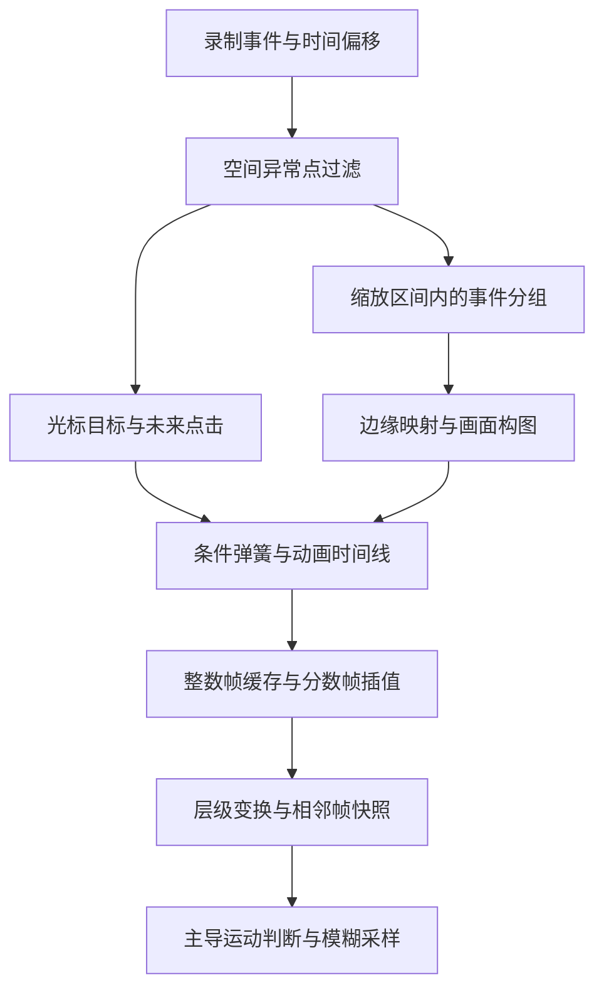

# 桌面动画处理链｜官方 3.7.5 静态研究

2026-10-01 调研记录｜参考：Screen Studio 3.7.5-4595，官方 Apple Silicon 分发包。项目已于 2026-10-02 开始开发；本文件仍仅代表静态研究结论，开发状态见[开发进度](../docs/开发进度.md)。

## 1. 证据范围与本轮结论

本轮沿官方安装包的事件模型、渲染节点、动画时间线和滤镜调用继续追踪。包来源、签名和完整资源哈希见[官方证据清单](evidence/2026-09-30-official-3.7.5/manifest.json)；本轮函数定位见[静态定位表](evidence/2026-09-30-official-3.7.5/animation-chain-locators.json)。以下为代码路径的静态事实及明确标注的推论，尚无受控工程／导出的逐帧验证。

分析副本只放在系统临时目录；字符串解码仅求值隔离的字符串表、索引器和表旋转初始化，没有执行应用业务代码。重要分支复核原始资源、导入／导出映射与数字常量。本项目保存推导说明、定位与哈希，不收录整份应用代码。

本轮确认：**手感来自事件预处理、未来事件规划、逐帧状态更新、焦点构图和滤镜采样的组合。只取同组弹簧数值不足以复现。** 每项细节均受[项目目标的 1:1 验收要求](../docs/项目目标.md)约束；静态路径已定位不表示复现已达成。

此图概括已定位的关联路径，未覆盖捕获、光标资源换型和全部编辑功能。

## 2. 事件预处理不是简单的时间去抖

定位：`D4qqfDv_.js` 的 `xne`、`nne`、`xR`、`TR`、`uv`。

- 基础配置 `removeCurshorShakeTreshold = 500`。拼写按原字段保留。
- `TR` 分别处理偏移后的 `mouseclicks` 和 `mousemoves`，之后合并为按时间排列的 `mouseEvents`。
- 距离是 `|dx| + |dy|`；阈值作用于事件坐标距离，**不是 500 ms 的时间窗口**。坐标与逻辑点／像素的关系仍需追踪捕获端。
- 按原序列检查当前事件与后一个、后两个事件。任一后续事件缺失或距离不大于阈值，保留当前事件；两者都存在且距离都严格大于阈值时，当前事件被去除。
- 被去除的 `mouseDown` 会置一个标记，随后遇到的 `mouseUp` 也被去除并清除标记。其他被去除事件返回 `undefined`；`uv` 只过滤 `null`／`undefined`。

这是向后查看两个事件的空间过滤路径。它可能删除正常的大跨度操作，实际输入频率、事件分布及开关效果必须实测；不得只凭字段名称将其改写为惯常低通平滑算法。

## 3. 光标目标、点击、拖拽与旋转

定位：`5NxSBPmq.js` 的 `Ax`、`Vd`、`OA`、`JA`、`$A`、`ek`、`ok`；事件查找来自 `D4qqfDv_.js` 的 `Rw/cS` 和 `sm/lS`。

`Rw` 查找第一个时间大于或等于当前时刻的事件；`sm` 查找当前时刻之前／等于当前时刻的事件。恰好同时间多事件的选择也应列入边界验证，不能随意改成线性插值。

### 光标位置和条件弹簧

`Vd` 在启用运动平滑时，若未来／当前点击距当前时刻 **不超过 500 ms**，直接把该点击坐标作为位置目标；否则取当前／之前的 `mouseEvents` 位置，无前序事件时回退到第一个事件。这里是**目标提前改变**，不是最终显示光标已经到达点击点。

`cursor-mover` 节点按下表顺序选择弹簧。`stiffness/damping/mass` 的单位仍按原求解器定义，不能直接套入其他库。

| 优先条件 | 静态选择的参数 k / c / m | 定位 |
|---|---|---|
| 全局关闭平滑，或当前切片关闭平滑 | 1 / 1 / 0 | `ITe`，零质量走吸附目标路径 |
| 未来／当前点击距当前时刻不超过 175 ms | 530 / 40 / 1 | `Ax` → `TTe` |
| 上一个／当前移动事件为 `mouseDragged` | 1000 / 40 / 1 | `JA` → `CTe` |
| 其余 | 工程 `mouseMovementSpring` | 基础对象为 470 / 70 / 3；有效工程值可被覆盖 |

因此点击临近时的参数与拖拽参数不能从平滑档位的名称推断；点击分支优先于拖拽分支。片尾停留、循环光标位置和动态来源边界还会影响目标，需要继续完整核对。

### 旋转、点击缩小与隐藏

- `OA` 以经过目标规划的 `Sy(t)` 与 `Sy(t-400 ms)` 的水平差，乘 `0.03 × cursorRotateOnXMovementRatio`，限制在 **[-20°, 20°]** 后加基础旋转。位置减去该时刻来源边界的原点。它不等于官网演示的瞬时速度旋转公式。
- `$A` 取未来／当前点击：下一事件为 `mouseDown` 且相差不超过 **130 ms**，或下一事件为 `mouseUp` 时，目标缩放为 **0.8**。后一个条件不额外判断 130 ms；体现按住期间的状态。无下一事件返回空样式。
- `ek` 可把隐藏目标设为 `alpha=0, scale=0.8, blur=5`。启用静止隐藏时，未来移动距当前时刻严格小于 **250 ms** 就先恢复可见；停留超过工程隐藏阈值才进入隐藏。首次移动之前、切片强制隐藏和片尾处理有独立分支。
- 点击与隐藏样式在 `ik` 合并；同时存在时点击缩放字段后合并。外层 `zoomer-and-fader` 使用 **300 / 30 / 0.3**；内层 `mask-blurrer` 使用 **1430 / 70 / 1**，另有光标图形／遮罩处理。

基础对象的 `mouseClickSpring = 700 / 30 / 1` **不是这条已定位点击缩小调用的实际参数**。保留配置事实，同时记录调用事实；不能把存在一个字段当成该效果必然使用它。

## 4. 桌面求解器与时间线

定位：`D4qqfDv_.js` 的 `YS`、`xfe`、`lF`、`Tfe`、`fF`、`Cfe`；`5NxSBPmq.js` 的 `C2`、`Ps/Io/I1/l0`、`gG`、`fG`、`Zd`。

### 数值与状态规则

`YS` 是半隐式 Euler：时间由 ms 转为秒，先以弹簧力与阻尼计算新速度，再用新速度推进位置。启用 `clamp` 且越过目标时吸附；新速度绝对值和新位置误差均严格小于精度时吸附并清零速度。

求解器回退配置为 `90 / 9 / 1, clamp=false, precision=0.002`，它是库级回退值，不能冒充光标或镜头预设。

- `xfe` 将时长向上取整，从 1 开始按 1 ms 子步求解；最后若循环索引大于时长，子步使用 **索引减时长**。例如 16.666… ms 会走 16 个 1 ms 加约 0.333… ms，不能擅自“修正”为常规剩余小数步。向上取整超过 10000 时拒绝求解。
- `setTargetValue` 保留当前速度。目标变化时有效精度为 `max(1, |当前位置-新目标|) × config.precision`；若两值相等，该辅助函数返回 1。
- `advanceTimeBy` 拒绝倒退时间。单次步长不小于估算 `settleTime` 或质量为 0 时吸附目标；其余走子步积分。
- `Tfe` 用归一化 0→1、初速度 0.000001、步长 1000/60 ms 估算收敛时间，模拟上限约 20000 ms；这与实际每帧的 1 ms 子步路径不同。收敛估算、吸附分支也影响结果。
- `Cfe` 按样式中的数值路径维护独立标量弹簧；部分目标字段缺失时跳过对应通道，不将其自动补为 0。

### 每帧更新次序

`gG` 把 `C2` 连接到实际渲染节点，使用播放配置的 fps，并提供播放时间→素材时间映射。每次模拟整数帧的顺序为：

1. 计算该帧播放时间及映射后的素材时间。
2. 用已有目标／参数推进弹簧到该播放时间。
3. 用素材时间获取并设置新目标。
4. 按禁用动画条件吸附目标。
5. 按素材时间获取并更新弹簧参数。
6. 缓存该帧数值。

目标和参数的更新在推进之后，顺序不能交换。播放／素材时间也不能合并；变速、裁剪和跳转都必须另测。

`Ps` 将时间换算成帧索引：距整数严格小于 `1e-7` 时先吸附整数，再向下取整。`Io` 将索引转回时间，同样有近整数吸附。时间线具有 **3500 ms** 影响窗口和 **60 帧** 提前计算缓存；无状态、倒退或跨越窗口时，从请求时间减 3500 ms 重新初始化，初始化时间限制为非负并量化到帧。

**初始化的细节待验证：** `resetSpringAtTime` 直接用初始化时刻请求样式，没有走循环内的素材时间映射。此处仅记录原路径，不能在没有变速／裁剪样本时断言它完全等价或自行调整。

`fG` 对整数帧直接读时间线，对分数帧在相邻整数帧样式之间递归线性插值。播放中使用 `frameFraction`，停止时使用整数 `frame`。因此“整数帧离散求解”和“画面只能在整数帧变化”是不同结论。

## 5. 自动焦点的位置与边缘构图

定位：`5NxSBPmq.js` 的 `Qk`、`$k`、`Ly/Jk`、`qk/tZ`、`rZ/iZ`、`nZ/lZ/hZ`；范围事件 getter 来自 `D4qqfDv_.js` 的 `kc`。

初稿时间区间按[已修正的上一轮规则](官方3.7.5自动焦点初稿.md)生成：点击时间和写回的区间端点均向下取整。本节解释已生成区间内的焦点位置，不能混为点击触发时机。

- `kc.mouseEvents` 返回区间起止时间内的事件。`Qk` 有点击时的分支虽出现点击数组，却使用逗号表达式，最终返回始终为真的 filter 结果；无点击时直接返回 `mouseEvents`。**此版本此路径实际使用区间内全部鼠标事件，不是只用点击列表。** 已复核原始表达式的谓词为 `!0`。
- 空区间回退到区间开始时刻之前／当前的事件；仍不存在时取开始时刻之后的第一个事件。
- 分组尺寸来自 `screen / swap(scaleToFillContentArea) / range.zoom`，再逐轴乘 **x=0.5、y=0.7**。
- `Jk` 按事件顺序贪心分组。加点后的包围盒宽、高都不超过分组尺寸时继续当前组，否则新开组；没有在这个函数里做全局聚类。
- 组中心是包围盒中心。`tZ` 依据组的首事件时间选当前／之前的组，无前序组时回退首组；中心包含该组后续事件，因此也依赖未来轨迹。片尾位置有优先分支，手动焦点有独立路径。
- `rZ/iZ` 将焦点坐标归一化，限制边缘比例，再把 `[边缘比例, 1-边缘比例+0.0001]` 映射到 `[0,1]`。导入的 `$o/uS` 默认在区间外 clamp；该微小偏移应保留作边界对照。
- `nZ` 根据缩放后内容和框大小构造居中的有效框，再在可放置的左上／右下位置之间映射焦点，输出缩放和相对位置。坐标继续经过裁切、inset、initialZoom 和来源尺寸变换。

**推论：** 后期镜头稳定性部分来自“提前看完整组并选包围盒中心”，实时只看已发生事件时无法直接取得同一目标。需要继续追踪最长前瞻范围与构图变换；不能只拿 500 ms 光标前瞻就声称整条镜头管线可以等价实时复现。

## 6. 相邻帧模糊与采样细节

定位：`5NxSBPmq.js` 的 `fG`、`E2`、`hx/$2/q2`、`Q2/J2`、`iG/sG/nG`、`lx/H2`、`Ch/k2`。

- `fG` 根据当前帧和前一帧的层级变换快照计算边界；并非只用某个弹簧的裸速度。祖先平移、缩放参与最终边界。
- `q2` 比较边界中心位移长度和边界尺寸变化长度，尺寸变化严格更大时选 zoom，否则选 move；选定变化长度小于 1 时无该滤镜。选中分项强度为 0 时不自动改用另一分项。
- `Q2` 会递归扣除带运动模糊的父层位移；相减后某轴符号与父层该轴符号不同，该轴置 0。这会影响光标随镜头运动时的模糊，不能各层独立使用屏幕位移后叠加。
- 分项强度按 `fps / 60` 换算。位移向量乘强度后长度小于 **0.01** 不加位移滤镜；其余请求 kernel **21**，传入 offset **-向量长度/2**。
- `H2` 先取中心样本，再取 kernel-1 个等权样本，最后除以 kernel。代入本调用的 offset 后采样偏移为 `velocity × i/(kernel-1)`：**这条调用是单侧分布，不是对称居中分布**；固定 21 时为中心加 20 个附加样本，其中 i=0 与中心重合。过滤器的 padding 也由向量决定。
- 缩放强度为 `abs(1-当前边界对角线/上一帧边界对角线) × 分项强度`；模糊中心由两帧对应角点的运动线求交得到，失败时不加该滤镜。
- 缩放 shader 最大 kernel 在此调用为 **13**，采样沿指向中心的方向，比例 `(t+offset)/13`；offset 来自依赖纹理坐标的确定性伪随机函数，权重为 `4×(p-p²)`，最后按权重总和归一化。半径梯度会影响强度与循环提前终止条件；不是 13 个简单等权副本。
- shader 中额外预乘／还原 alpha 的两行均被注释。不能由此断言输入没有预乘 alpha；输入纹理、Pixi 混合、滤镜区域和透明边缘仍需追踪与输出验证。

关于画布与模糊的总体边界见[画布与运动模糊](画布与运动模糊.md)。上述采样次数是已定位 shader 与调用参数的静态推导，不是 GPU 实测或预览／导出一致性的证明。

## 7. 下一轮应优先解决的缺口

1. 捕获事件的坐标单位、热点和资源换型；同时间事件排序、跨录制 session 的时间偏移。
2. `Sy` 全部目标分支、片尾停留／循环与切片开关；预处理对真实大跨度输入的影响。
3. 镜头裁切、尺寸、initialZoom 和边缘映射的完整单位链；组中心前瞻的时间范围。
4. 跳转、变速、裁剪后的初始化行为；整数帧缓存与分数帧画面之间的区别。
5. 模糊的滤镜区域、纹理 alpha、遮罩、父子层次与最终导出调用是否一致。
6. 受控参考素材和逐帧输出。没有这一步，所有静态结论仍不能升级为 1:1 复现通过。

对应实验条目见[验证计划](验证计划.md)和[待验证交接](../docs/待验证项目交接.md)。
